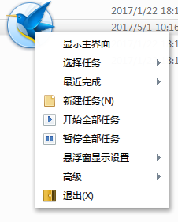

## 前言:
> Electron中文文档! 精心翻译,完美排版,实时同步更新! (本文档未经同意不得传播!) , 最后同步:2017-05-23

### QQ交流群:
- 群名称：Electron/Nw.js开发交流群
- 群   号：535260421
- 创   建：2017-05-19
- 宗   旨：严禁广告,仅为Electron/Nw.js应用开发交流,译者群主将不定期分享DEMO文件给大家交流学习使用.

### 群内DEMO文件教程列表:
1. 001自定义托盘菜单界面.zip


2. 002迅雷悬浮窗右键快捷菜单.zip



3. 003渲染进程内实时在线或离线提示.zip


4. 004系统托盘闪烁图标提示用户示例.zip


## 延伸拓展:
如果API中所列功能无法满足你的需求时,[chrome-app-samples](https://github.com/GoogleChrome/chrome-app-samples)是你最好的选择.

## 多平台支持:
众所周知,目前的Electron主要支持桌面版系统的跨平台,例如Win,Linux,MacOS.并不支持(未来可能也不会支持)移动端如Android,iOS等.

相对而言,Electron的门槛非常低,仅需掌握少量Web语言即可入门,但是更多人的需求是:'Write once, run anywhere'(一次撰写，多端运行).

比如,对中国用户而言,Win+Android+iOS三平台支持就是最大的需求主流.

所以此处列举了常见的跨平台开发工具,也欢迎大家推荐更多优秀工具:

### 原生应用
+ [React-Native](https://github.com/facebook/react-native) -  作者Facebook,Javascript/React,目标平台:iOS/Android
+ [nativescript](https://github.com/nativescript) - JavaScript,目标平台:iOS/Android/Windows
+ [CrossAPP](https://github.com/9miao/CrossApp) - C++,目标平台:iOS/Android
+ [Xamarin](https://developer.xamarin.com/) - C#,目标平台:iOS/Android/Windows/Mac
+ [QT](http://www.qt.io/mobile-app-development/) - C++,Android/iOS/Windows 10 Mobile/BlackBerry 10/Ubuntu/Sailfish
+ [JUniversal](http://juniversal.org/) -  Java,目标平台:iOS/Android
+ [Kivy](http://kivy.org/#home) -Python,目标平台:iOS/Android/Windows/Mac/Linux
+ [Weex](http://weex.apache.org/cn/) - 作者阿里巴巴,Web,目标平台:iOS/Android
+ [Flutter](https://github.com/flutter/flutter) -  作者谷歌团队,目标平台:iOS/Android

### 混合应用
+ [CrossWalk](https://github.com/crosswalk-project/crosswalk)
+ [Cordova](http://cordova.apache.org/)
+ [mobile-chrome-apps](https://github.com/MobileChromeApps/mobile-chrome-apps)
+ [Titanium](https://github.com/appcelerator/titanium.git)
+ [PhoneGap](https://github.com/phonegap/)
+ [ionic](https://github.com/driftyco/ionic)
+ [sencha](https://www.sencha.com/customers/)
+ [coronalabs](https://coronalabs.com/)
+ [CocoonJS](https://github.com/ludei/cocoonjs-cli)

### 更多选择
除了上方列举的开发工具之外,你还可以在[这个页面](http://propertycross.com)上看到更多的工具并欣赏用它们开发的作品截图.

## Electron通用安装(第一二步请选择适合自己的系统):

* 1.[Node.js安装](https://nodejs.org/en/download/)      
* 2.[git安装](https://git-for-windows.github.io/)     
* 3.开始菜单中运行cmd或终端中,粘贴下方命令: 
没有翻墙VPN的同学使用:
 ```
npm install cnpm -g --registry=http://registry.npm.taobao.org
cnpm install electron -g               
```
可翻墙的同学使用:
 ```
npm install electron -g 
```

没有error错误提示的话,这样就安装完成了

你可以在cmd或终端中输入命令 `electron -v` 如果出来个版本号就可以了.

* 4.创建demo应用:将[quick-start](/quick-start)目录中的四个文件放到任意目录,点击 `start.bat`,弹出 `安装成功啦!`提示,即创建成功.

_注意_:[quick-start](/quick-start)目录为示范文件,你可以任意修改.

* 5.electron 常用的npm命令:
 ```
安装:npm install electron -g 
升级:npm update electron -g
卸载:npm uninstall electron -g
```

## Electron学习要点:

1. 由于Electron基于Node.js,对于新手而言,入门第一关应当稍微熟悉[Node.js的文档](https://nodejs.org/dist/latest/docs/doc/api/).            

特别是如os,path等常用模块化的引用,这是非常必要的.

2. Electron文档的学习,本文档中的方法,属性等列举的非常明细,它们的使用方法,你只需稍微观察[quick-start](/quick-start)目录即可明白.

只有一点,你需要特别的记住,Electron分为主进程和渲染进程,这两个进程的概念贯穿全程! 

当你遇到需求进行查阅文档时,你需要先判断所属进程,再判断功能区域,这样即可确定API所在章节,例如,调用系统打印机进行打印小票:

 * 调用系统打印机(与系统交互类的多数为主进程)

 * 打印内容发生在页面内容即功能区域为webcontents([网页内容](api/web-contents.md)章节)    

 * API需求为打印,搜 `print`([打印窗口页面](api/web-contents.md#contentsprintoptions))           

## 常见问题:

提交issue前(欢迎提出各种自己想做但不知如何实现的需求),请详读以下常见问题:

* [Electron 常见问题](faq.md)        

## 兼容注意:

* 与Jquery等第三方js插件的兼容相关
```
<script src=`jquery.min.js`></script>
<script>if (typeof module === 'object') {window.jQuery = window.$ = module.exports;};</script>
```


## 开发指南目录:
* [构建说明(Linux)](development/build-instructions-linux.md)   
* [构建说明(macOS)](development/build-instructions-osx.md)
* [构建说明(Windows)](development/build-instructions-windows.md)
* [构建系统概述](development/build-system-overview.md)
* [编码规范](development/coding-style.md)
* [在 macOS 中调试](development/debugging-instructions-macos.md)
* [在 Windows 中调试](development/debug-instructions-windows.md)
* [在C ++代码中使用clang-format](development/clang-format.md)
* [在调试器中设置符号服务器](development/setting-up-symbol-server.md)
* [源代码目录结构](development/source-code-directory-structure.md)
* [Chrome升级清单](development/upgrading-chrome.md)       
* [Chromium 开发指南](development/chromium-development.md)       
* [V8 开发指南](development/v8-development.md)       

## 教程目录:
* [关于 Electron](tutorial/about.md)
* [Electron 版本说明](tutorial/electron-versioning.md)
* [API弃用说明](tutorial/planned-breaking-changes.md)
* [快速入门](tutorial/quick-start.md)
* [支持的平台](tutorial/supported-platforms.md)
* [桌面环境集成](tutorial/desktop-environment-integration.md)
* [离屏渲染](tutorial/offscreen-rendering.md)
* [系统通知](tutorial/notifications.md)
* [在线/离线事件检测](tutorial/online-offline-events.md)
* [多线程](tutorial/multithreading.md)
* [REPL](tutorial/repl.md)
* [键盘快捷键](tutorial/keyboard-shortcuts.md)  
* [DevTools扩展](tutorial/devtools-extension.md)   
* [使用原生模块](tutorial/using-native-node-modules.md)   
* [使用 Pepper Flash 插件](tutorial/using-pepper-flash-plugin.md)      
* [使用 Selenium 和 WebDriver](tutorial/using-selenium-and-webdriver.md) _(中文官译本,未精校)_
* [使用 Widevine CDM 插件](tutorial/using-widevine-cdm-plugin.md) _(中文官译本,未精校)_
* [应用分发](tutorial/application-distribution.md)
* [应用打包](tutorial/application-packaging.md)
* [主进程调试](tutorial/debugging-main-process.md)
* [使用 node-inspector 进行主进程调试](tutorial/debugging-main-process-node-inspector.md)
* [使用 VSCode 进行主进程调试](tutorial/debugging-main-process-vscode.md)
* [Mac App Store应用提交指南](tutorial/mac-app-store-submission-guide.md)
* [Windows App Store应用提交指南](tutorial/windows-store-guide.md) _(中文官译本,未精校)_
* [安全，本地功能和你的责任](tutorial/security.md) _(中文官译本,未精校)_           
* [Headless CI Systems 测试](tutorial/testing-on-headless-ci.md) _(中文官译本,未精校)_                  

## API接口目录:
### 公用: 
* [应用语言](api/locales.md)   
* [开发概要](api/synopsis.md)  
* [专业术语](glossary.md)
* [常见问题](faq.md)
* [环境变量](api/environment-variables.md)
* [快捷键字符串](api/accelerator.md)
* [命令行](api/chrome-command-line-switches.md)
* [客户端请求](api/client-request.md)
* [剪贴板](api/clipboard.md) 
* [ `<File>` H5 File文件操作](api/file-object.md)   
* [无框窗口](api/frameless-window.md)
* [ `<window.open>` window.open打开新窗口或打开时传递消息](api/window-open.md)                  
* [沙盒选项](api/sandbox-option.md)       

### 主进程:
* [整体控制](api/app.md)              
* [全局快捷键](api/global-shortcut.md)           
* [图标创建与应用](api/native-image.md)
* [屏幕](api/screen.md)       
* [窗口](api/browser-window.md)
* [菜单](api/menu.md)           
* [菜单项](api/menu-item.md)
* [系统托盘](api/tray.md)       
* [网页内容](api/web-contents.md)
* [从主进程到渲染进程的异步通信](api/ipc-main.md)          
* [对话框](api/dialog.md)
* [创建和控制视图](api/browser-view.md)
* [会话](api/cookies.md)
* [会话,缓存和代理等控制](api/session.md)
* [页面请求](api/web-request.md)
* [HTTP/HTTPS请求处理](api/incoming-message.md)
* [协议的注册和处理](api/protocol.md)
* [使用系统默认应用程序管理文件或URL](api/shell.md)
* [下载项管理](api/download-item.md)
* [进程控制](api/process.md)
* [Chromium原生网络库](api/net.md)
* [获取系统首选项](api/system-preferences.md)
* [电源状态](api/power-monitor.md)
* [节能管理](api/power-save-blocker.md)
* [调试工具](api/debugger.md)
* [奔溃报告](api/crash-reporter.md)
* [性能数据收集](api/content-tracing.md)
* [自动更新](api/auto-updater.md)
* [TouchBar触摸条](api/touch-bar.md)
* [TouchBar触摸条按钮](api/touch-bar-button.md)
* [TouchBar触摸条拾色器](api/touch-bar-color-picker.md)
* [TouchBar触摸条分组](api/touch-bar-group.md)        
* [TouchBar触摸条scrubber](api/touch-bar-scrubber.md)          
* [TouchBar触摸条分段控件](api/touch-bar-segmented-control.md)      
* [TouchBar触摸条label标签](api/touch-bar-label.md)
* [TouchBar触摸条弹出框](api/touch-bar-popover.md)
* [TouchBar触摸条滑块](api/touch-bar-slider.md)
* [TouchBar触摸条间隔符](api/touch-bar-spacer.md)                            

### 渲染进程:
* [页面渲染](api/web-frame.md)   
* [ `<webview>` webview标签](api/webview-tag.md)                                                     
* [渲染进程与主进程通信](api/remote.md)     
* [从渲染进程到主进程的异步通信](api/ipc-renderer.md)
* [子窗口](api/browser-window-proxy.md)
* [捕获桌面资源](api/desktop-capturer.md)                                  

### API中的结构列表:
* [蓝牙设备对象](api/structures/bluetooth-device.md)
* [证书对象](api/structures/certificate-principal.md)
* [证书主体对象](api/structures/certificate.md)
* [Cookie对象](api/structures/cookie.md)
* [崩溃报告对象](api/structures/crash-report.md)
* [桌面捕获源对象](api/structures/desktop-capturer-source.md)
* [显示器对象](api/structures/display.md)  
* [打印机信息对象](api/structures/printer-info.md)    
* [文件过滤器对象](api/structures/file-filter.md)
* [最近使用的项目](api/structures/jump-list-category.md)
* [常用列表项](api/structures/jump-list-item.md)
* [CPU使用率对象即程序占用的CPU资源](api/structures/cpu-usage.md)
* [IO值对象](api/structures/io-counters.md)
* [内存信息对象](api/structures/memory-info.md)
* [进程内存信息对象](api/structures/process-memory-info.md)
* [内存使用详细信息](api/structures/memory-usage-details.md)
* [Mime类型缓冲区](api/structures/mime-typed-buffer.md)
* [矩形对象](api/structures/rectangle.md)
* [删除客户端证书对象](api/structures/remove-client-certificate.md)
* [删除密码对象](api/structures/remove-password.md)
* [Scrubber项对象](api/structures/scrubber-item.md)
* [分段控制对象](api/structures/segmented-control-segment.md)
* [快捷方式对象](api/structures/shortcut-details.md)
* [任务对象](api/structures/task.md)
* [缩略图工具栏按钮对象](api/structures/thumbar-button.md)
* [上传blob对象](api/structures/upload-blob.md)
* [上传数据对象](api/structures/upload-data.md)
* [上传文件系统对象](api/structures/upload-file-system.md)
* [上传文件对象](api/structures/upload-file.md)
* [上传原始数据对象](api/structures/upload-raw-data.md)         