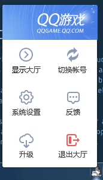
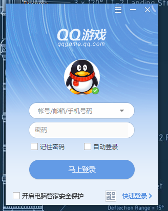
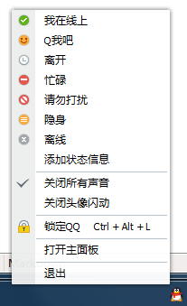
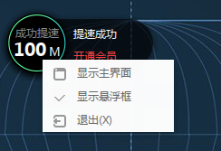
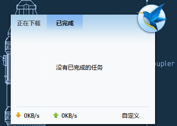

## 前言:
本目录为本人app的创作杂记,目标为创建具有与jquery,php完全融合一体的电商管理平台.

## 应用流程:
   
### 初始载入:托盘图标_Tray_

* 1. 系统托盘 - `.json`
  * 1.1 图标 - 离线图标(图标统一格式: `png`,个人状态:正常,忙碌,离开,离线,信息状态:新消息闪烁)
  * 1.2 单击显示主窗口
  * 1.3 右击菜单
    * 1.3.1 灰色待登录头像
    * 1.3.2 帮助 - 弹出工单提交窗
    * 1.3.3 反馈 - 弹出反馈提交窗
    * 1.3.4 退出 - 关闭应用
    
图示:

> API: [系统托盘](/api/tray.md)               

### 初始载入:载入动图_Loading_

* 2. 动图Loading窗 - `.json`
   * 2.1 服务更新 - 服务器端进行维护或暂停时弹出提示并冻结应用.
   * 2.2 设备与性能 - 屏幕,系统,语言等,载入适合的大小与界面语言.
   * 2.3 版本更新 - 新版本时进行更新并重载本窗.
   * 2.4 安全扫描 - 无任何登录记录的本异地使用(如新装,异地下载后安装,弹出主管手机确认码
   * 2.5 动图滑动为登录窗
   
 图示:
 

### 初始载入:监听

* 0. 全程监听 - `online-offline`
* 实时联网 - 断网即显示线下状态
> API: [在线/离线事件检测](/tutorial/online-offline-events.md)               
       
### 初始载入:登录窗

* 3. 登录窗 - `.json`
   * 3.1 窗口菜单
     * 3.1.1 小菜单
        * 3.1.1.1 注册账号
        * 3.1.1.2 找回密码
        * 3.1.1.2 使用条款
        * 3.1.1.2 关于应用
        * 3.1.1.2 退出
     * 3.1.2 最小化
     * 3.1.2 退出
   * 3.2 头像
   * 3.3 账号输入框 - 邮箱/手机号/工号
   * 3.4 密码输入框 - 密码
   * 3.5 记住密码/自动登录
   * 3.6 现在登录
   * 3.7 APP/微信二维码 - 翻转显示可识别二维码.
   
   图示:
 
 

### 已登录后的业务载入:托盘变化

* 1. 系统托盘 - `.json`
  * 1.1 图标 - 在线图标
  * 1.2 单击显示窗口
  * 1.3 右击菜单
    * 1.3.1 个人头像,单位,职位
    * 1.3.2 个人功能区 - 根据用户自定义选择的5个以内的对应快捷菜单,以下以店长为例
        * 1.3.1 店铺管理
        * 1.3.1 店铺设置
        * 1.3.1 我要发货
    * 1.3.3 隐藏悬浮窗
    * 1.3.4 帮助 - 弹出工单提交窗
    * 1.3.5 反馈 - 弹出反馈提交窗
    * 1.3.6 注销 - 销毁用户缓存
    * 1.3.7 退出 - 关闭应用
   
 图示:
 

### 已登录后的业务载入:悬浮窗

* 2. 悬浮窗 - `.json` -展示消息,通知(如下单,下级店员权限申请)或快速菜单等,提高应用的便捷性
  * 2.1 单击 - 消息/任务/提醒小窗
  * 2.2 右击 - 快速菜单栏
    * 2.2.1 自定义的快速菜单栏
    * 2.2.2 显示主界面
    * 2.2.3 显示悬浮窗
    * 2.2.4 退出

 图示:
 

 

### 已登录后的业务载入:主平台

* 3. 主平台 - `.json` - 综合性处理的主窗口(多身份通用型)
   * 3.1 窗口菜单
     * 3.1.0 主题设置 - 弹出可选主题. 
     * 3.1.1 小菜单
        * 3.1.1.1 系统设置
        * 3.1.1.2 检查更新
        * 3.1.1.2 切换账号
        * 3.1.1.2 关于应用
        * 3.1.1.2 退出
     * 3.1.2 全屏
     * 3.1.3 最小化
     * 3.1.4 最大化
     * 3.1.5 关闭
   * 3.2 系统公告区
     * 3.2.1 系统公告
     * 3.2.2 在线人数统计(前后台)
   * 3.3 系统功能区
     * 3.3.1 前进
     * 3.3.2 后退
     * 3.3.3 搜索栏
     * 3.3.2 快速直达区
   * 3.4 用户资料区
     * 3.4.1 头像
     * 3.4.2 用户名
     * 3.4.3 所在店铺
     * 3.4.4 当前职位
     * 3.4.5 编辑资料
     * 3.4.6 消息盒子
     * 3.4.7 个人记录
   * 3.5 系统业务区
     * 3.5.1 主页
     * 3.5.2 应用中心
     * 3.5.3 商店
     * 3.5.4 个人功能区
     * 3.5.5 内部交流区
   * 3.6 系统内容区域- 自适应模块式布局