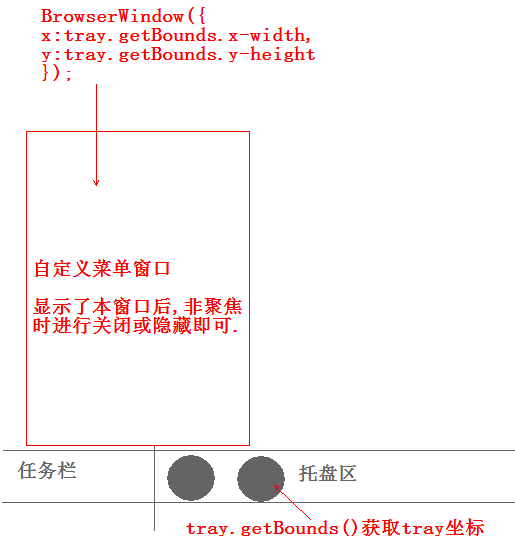

# 常见问题
>除了官方内容外,还直接集合了各种常见方法,适用于初学者和懒癌;

## Electron何时将Chrome升级为最新版本?

通常会在stable(稳定)版的Chrome发布后的两周内,不过由于工作量的问题,该时间并不能完全保证.

虽然我们只使用了稳定版Chrome,但是beta 或 dev 版中发布了重要的更新或修复时,我们会立即打上这个补丁.

更多细节,参考[安全，本地功能和你的责任](tutorial/security.md)_注意,该章节译者尚未精校,目前使用中文官译本_

## Electron何时将Node.js升级为最新版本?

 通常会在最新版Node.js发布一个月之后,以此来避免Node.js刚发布后的常见bug.

Node.js的新特性一般是由V8升级引起的,由于Electron使用的是Chrome浏览器内置的V8,所以Electron中常常内置了新 Node.js 才有的部分特性.


## 如何在两个网页间共享数据?
要在网页(渲染器进程)之间共享数据，最简单的方法是使用浏览器中已经可以使用的HTML5 API,如[Storage API][storage], [`localStorage`][local-storage], [`sessionStorage`][session-storage], 和 [IndexedDB][indexed-db].

你也可以利用Electron的IPC机制实现,先将主进程中的对象存储为全局变量,再通过 `electron`模块的 `remote`属性从渲染器访问它们.
```javascript
// 在主进程中
global.sharedObject = {
  someProperty: 'default value'
}
```

```javascript
// 在第一个页面中
require('electron').remote.getGlobal('sharedObject').someProperty = 'new value'
```

```javascript
// 在第二个页面中
console.log(require('electron').remote.getGlobal('sharedObject').someProperty)
```

##  为什么应用窗口或托盘图标在一段时间后消失不见了?

这是因为用于存储窗口和托盘的变量被垃圾回收了,更多细节请阅读以下文章:
* [Memory Management][memory-management]
* [Variable Scope][variable-scope]


如果你只是需要快速修复这个问题的话,你可以通过下面的方式更改变量作用域,以避免这个变量被垃圾回收.

示例:

```javascript
const {app, Tray} = require('electron')
app.on('ready', () => {
  const tray = new Tray('/path/to/icon.png')
  tray.setTitle('hello world')
})
```

改成:

```javascript
const {app, Tray} = require('electron')
//let的作用即防止被垃圾回收
let tray = null
app.on('ready', () => {
  tray = new Tray('/path/to/icon.png')
  tray.setTitle('hello world')
})
```

##  为什么在Electron中无法使用jQuery/RequireJS/Meteor/AngularJS ?

由于Electron集成了Node.js,所以在DOM中插入某些额外变量,比如  `module`, `exports`, `require`.等等. 这将导致许多库不能正常运行，因为它们也要插入同名变量。

我们可以通过禁用 Node.js 来解决这个问题:

```javascript
// 主进程中
const {BrowserWindow} = require('electron')
let win = new BrowserWindow({
  webPreferences: {
    nodeIntegration: false
  }
})
win.show()
```

但是,如果你仍然需要Node.js 和 Electron 的 API,那么你在引入那些库之前将这些变量重命名，比如:

```html
<head>
<script>
// 重命名 Electron自带的 require
window.nodeRequire = require;
delete window.require;
delete window.exports;
delete window.module;
</script>
<script type="text/javascript" src="jquery.js"></script>
</head>
```

或者使用这个:

```html
<script src=`jquery.min.js`></script>
<script>if (typeof module === 'object') {window.jQuery = window.$ = module.exports;};</script>
```

## 为什么  `require('electron').xxx` 结果是 undefined ?

使用Electron的内置模块时,你可能会遇到如下错误:

```
> require('electron').webFrame.setZoomFactor(1.0)
Uncaught TypeError: Cannot read property 'setZoomLevel' of undefined
```

这是由于你在项目或全局中已安装了[npm `electron` 模块][electron-module],这些模块把Electron内置模块覆盖了.

你可以输出`electron`模块的路径来验证是否使用了正确的内置模块:

```javascript
console.log(require.resolve('electron'))
```

然后,再检查一下格式是否是这样子的:

```
"/path/to/Electron.app/Contents/Resources/atom.asar/renderer/api/lib/exports/electron.js"
```

如果输出的路径类似 `node_modules/electron/index.js`,那么你需要移除或重名npm的 `electron`模块.

```bash
npm uninstall electron
npm uninstall -g electron
```
 如果问题依旧.你可能需要仔细检查一下拼写或可能在错误的进程中使用了该模块.比如 `electron.app`只能在主进程中使用,而 `electron.webFrame`只能在渲染进程使用.


## 有哪些asar文件常用命令?

asar文件常用命令,所在目录运行以下命令:

```
安装:$ npm install asar -g
压缩:$ asar pack app app.asar
解压:$ asar extract app.asar testpath
```

更多asar用法,请移步[应用分发](tutorial/application-distribution.md)               

## Electron是否可以创建可全透明并可穿透的窗口?
 目前Electron有两个不足：
 
 第一即无法创建可穿透的透明窗口（虽然可以通过禁用加速来实现,但得不偿失），这样限制了前台异形UI的发展。
 
 第二点即尚未支持或以后可能也不支持对移动端平台的支持，只能是自己绕着路子的实现，这样也就增加了开发成本。


## Electron自带的托盘右键菜单过丑,如何自定义托盘右键菜单?

Tray模块调用的是系统菜单,牺牲UI但强调了实用性.如果需要自定义菜单,有许多此类Node模块.此类问题你只需记得Electron不仅可以使用自身API创建相关内容,也可以充分利用Node API或相关模块,可以无限拓展.


当然你还可以使用以下方式轻松实现:



[memory-management]: https://developer.mozilla.org/en-US/docs/Web/JavaScript/Memory_Management
[variable-scope]: https://msdn.microsoft.com/library/bzt2dkta(v=vs.94).aspx
[electron-module]: https://www.npmjs.com/package/electron
[storage]: https://developer.mozilla.org/en-US/docs/Web/API/Storage
[local-storage]: https://developer.mozilla.org/en-US/docs/Web/API/Window/localStorage
[session-storage]: https://developer.mozilla.org/en-US/docs/Web/API/Window/sessionStorage
[indexed-db]: https://developer.mozilla.org/en-US/docs/Web/API/IndexedDB_API